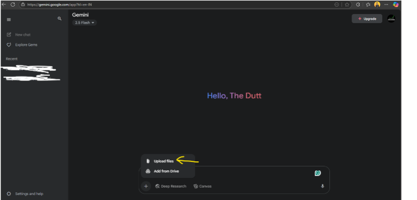
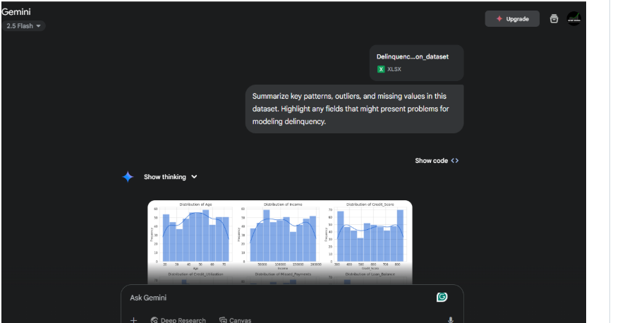
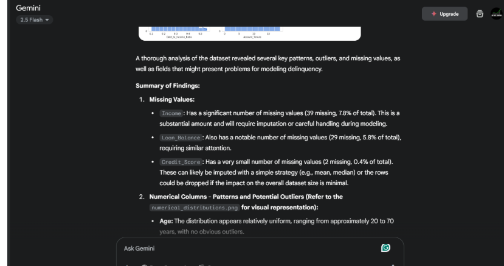
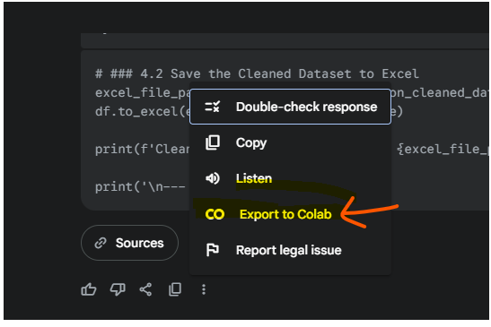

# TATA-GEN-AI-Powered-Data-Analytics-Project

# AI Transformation Project at Tata iQ – Credit Card Delinquency Prediction

## My Role
- I was an **AI Transformation Consultant** at Tata iQ, specializing in **data-driven decision-making** for financial services.
- Collaborating within a larger **data analytics team** to develop AI-powered solutions.
- Tasked with helping **Geldium Finance** reduce its high credit card delinquency rate by performing **advanced analytics** and building **AI/ML models** with **GenAI assistance**.

## Goal
- Analyze customer data and **predict delinquency risks** using AI-driven techniques.
- Develop a **recommendation framework** to help the Head of Collections determine the **best intervention strategies** for at-risk customers.
- Ensure AI-driven solutions are **ethical, explainable, and effective** in supporting responsible financial decision-making.
  

## TASK 1: EDA USING GEN-AI
Exploratory Data Analysis (EDA) is critical in financial services for risk assessment. It helps identify factors contributing to credit card delinquency and builds stronger prediction models.

### Why EDA Matters
- **Ensures data integrity:** Identifies missing values, duplicates, and inconsistencies.
- **Highlights patterns and anomalies:** Detects trends in customer behavior, such as spending patterns before delinquency.
- **Prevents biased models:** Ensures diverse data representation to reduce unfair treatment.
- **Supports better decision-making:** Provides Collections and Risk teams with clear insights for proactive engagement.

### Reviewing the Dataset using GenAI
Tools: **Gemini**, **ChatGPT**, **DeepSeek**  
Steps:
1. Download the dataset.
2. Upload the data in GenAI.

   
   
3. Use prompts like:
   - `"Summarize key patterns, outliers, and missing values in this dataset. Highlight any fields that might present problems for modeling delinquency."`
   - `"Identify the top 3 variables most likely to predict delinquency based on this dataset. Provide brief reasoning."`
     
   

   

### Data Analysis Findings
**Notable Missing or Inconsistent Data**
- **Missing Values:**
  - Income: 7.8% missing (39/500 records) → requires imputation or careful handling.
  - Loan_Balance: 5.8% missing (29/500 records) → needs attention.
  - Credit_Score: 0.4% missing (2/500 records) → manageable via imputation.
- **Inconsistent Data:**
  - Employment_Status contains variations like `'Employed', 'employed', 'EMP', 'Self-employed', 'Unemployed', 'retired'`.
  - Standardization required for accurate analysis and feature encoding.

**Key Anomalies (Outliers and Distribution)**
- Credit_Utilization slightly above 1.0 (max: 1.025843) → possible data entry errors or extreme cases.
- Right-skewed distributions:
  - Income, Credit_Utilization, Loan_Balance → may require log transformation.
- Delinquent_Account Imbalance: 84% non-delinquent (0), 16% delinquent (1) → requires oversampling/undersampling or cost-sensitive learning.

### Addressing Missing Data & Quality Issues
- **Remove:** Drop columns with excessive missing data.
- **Impute:** Use mean, median, or predictive modeling.
- **Generate Synthetic Data:** Create realistic values using AI while maintaining fairness.

Prompts:
- `"Suggest an imputation strategy for missing values in this dataset based on industry best practices."`
- `"Propose best-practice methods to handle missing credit utilization data for predictive modeling."`
- `"Generate realistic synthetic income values for missing entries using normal distribution assumptions."`

> After this step, the dataset can be further cleaned in Python for analysis.

 

## TASK 2: Predictive Modeling using GEN-AI
Objective: Predict **high-risk customers** to reduce delinquency and guide Collections interventions.

### Steps
1. Develop a predictive model using **GenAI tools**.
2. Select and justify the **best approach**: decision trees, logistic regression, neural networks, etc.
3. Define a plan to **evaluate model performance**, ensuring **fairness and explainability**.

### How GenAI Assists
1. **Selecting the right model type:**
   - Decision Trees: Explains predictions clearly.
   - Logistic Regression: Predicts binary outcomes.
   - Neural Networks: Handles complex patterns but less interpretable.

   **Prompt:** `"Based on this dataset, which predictive modeling techniques are best suited for identifying customers likely to miss payments? Explain why."`

2. **Generating model code without coding:**
   - GenAI generates initial workflow in **Python/R/SQL**.

   **Prompt:** `"Generate a logistic regression model framework using this dataset to predict customer delinquency. Provide an explanation of each step, ensuring outputs are reviewed and refined for accuracy and fairness."`

3. **Evaluating model performance:**
   - Suggests metrics: **accuracy, precision, recall**.
   - Interprets results and flags biases.
   
   **Prompt:** `"Evaluate the performance of this predictive model using precision and recall. Identify any biases in the predictions."`

> Using GenAI accelerates model building and refinement, making AI-driven decision-making accessible to financial teams.

## TASK 3: Additional Refinement
Objective: Convert predictive insights into a **stakeholder-ready report** for Geldium’s Head of Collections.

### Summary of Predictive Insights
- Identify **high-risk customer segments**.
- Highlight **variables that influence delinquency**.

Prompts:
- `"Summarize top predictors of customer delinquency based on dataset analysis."`
- `"Identify customer segments with the highest delinquency risk and explain why."`

### GenAI Output
**High-risk segments:**
1. **Customers with recent 'Late' payment increase:**
   - Observation: Higher proportion of late payments in Month_4 and Month_5.
   - Interpretation: Indicates immediate risk trend.
2. **Customers with higher Credit Utilization and Debt-to-Income Ratios:**
   - Observation: Slightly higher mean values for delinquent accounts.
   - Interpretation: Shows financial strain → higher likelihood of missed payments.

> Historical averages (Credit_Score, Missed_Payments, Loan_Balance) were less predictive, showing **recent behavior patterns** drive current delinquency.

## TASK 4: Final Presentation
- Compile **EDA insights**, **predictive model framework**, and **high-risk segments** into a structured report.
- Include clear **recommendations** for the **Collections team**.
- Ensure the presentation is **ethical, explainable, and actionable** for decision-makers.

---

# Notes
- All analyses were performed using **GenAI-assisted workflows**.
- Steps can be adapted for **Python notebooks** for further exploration and refinement.
- This project demonstrates **data-driven AI transformation** in **financial services risk assessment**.
